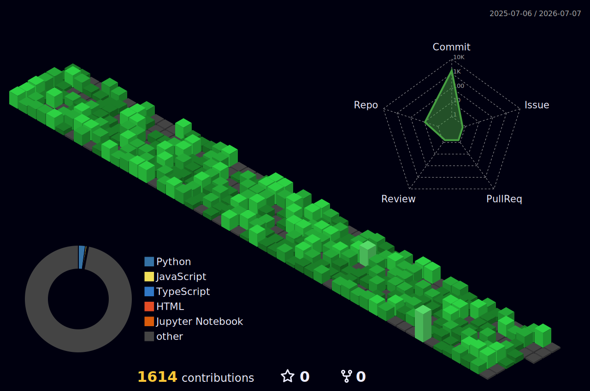

<!--  -->

<h1 align="center">Hi 👾 , I'm Rudriya Bansal</h1>

[comment]: # ()

[comment]: # ()

<h1>Language and Tools:<h1/>

	<code></code>
	<code></code>
	<code></code>
	<code></code>
	<code></code>
	<code></code>
	<code></code>
	<code></code>
	<code></code>
	<code></code>
	<code></code>
	<code></code>
	<code></code>
	<code></code>
	<code></code>
	<code></code>
	<code></code>
	<code></code>
	<code></code>
	<code></code>
	<code></code>
	

Contribution Graph:

 <!-- 
 <!--  ### 🔝 Top Contributed Repo
-->

 

GitHub Stats:
 

  
  

Contribution History:
 

  

	
Socials:
 

  
  

